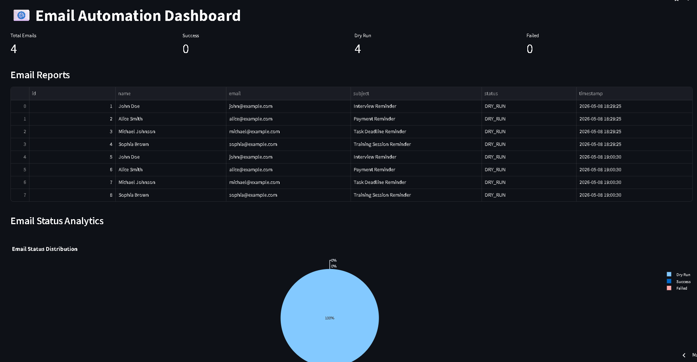
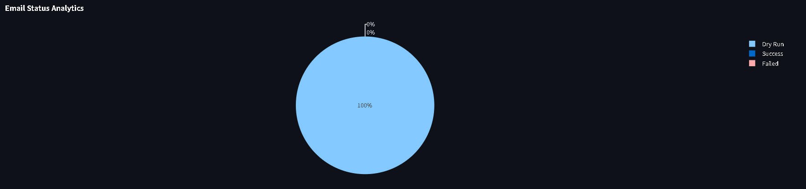
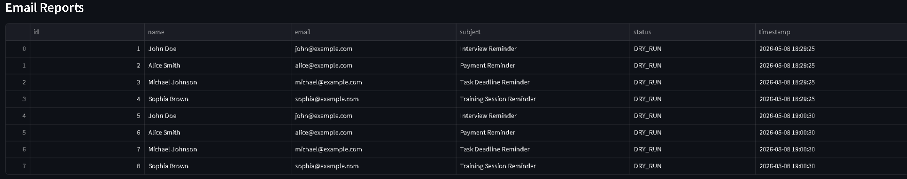
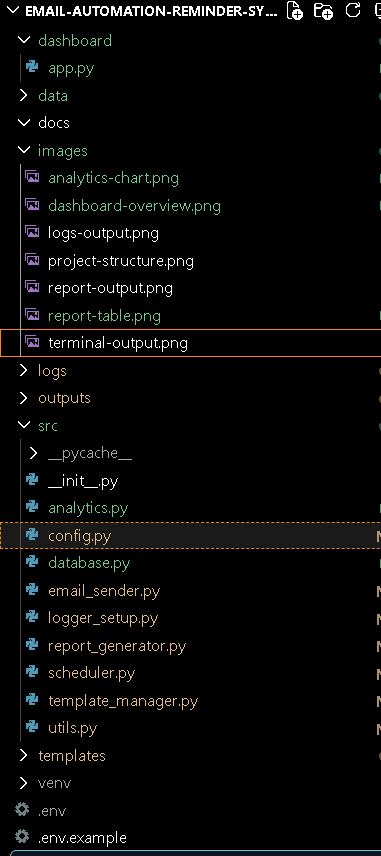
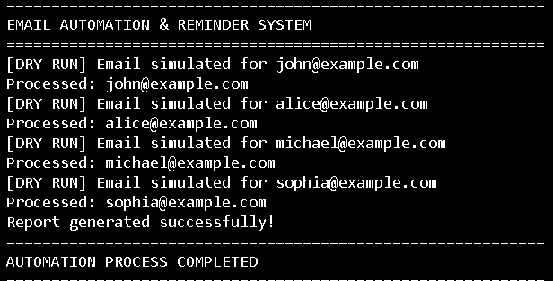

# 📧 Advanced Email Automation & Reminder System


---

# 🌐 Live Deployment

👉 https://email-automation-reminder-system-5lbdj2vtrbzvg8fwzqt2kk.streamlit.app/

---

# 📌 Project Overview

The **Advanced Email Automation & Reminder System** is a Python-based automation project designed to simulate real-world business email reminder workflows.

The system automates:
- reminder emails
- notification workflows
- logging systems
- analytics reporting
- dashboard visualization

This project demonstrates real-world automation concepts used in:
- HR operations
- finance reminder systems
- productivity workflows
- training notifications
- admin communication systems

---

# 🚀 Key Features

✅ Automated Email Reminder Simulation  
✅ Personalized Email Templates  
✅ HTML Email Support  
✅ CSV-Based Contact Management  
✅ SQLite Database Integration  
✅ Logging System  
✅ Automated Report Generation  
✅ Analytics Dashboard using Streamlit  
✅ Pie Chart Visualization using Plotly  
✅ DRY_RUN Safe Testing Mode  
✅ GitHub & Deployment Ready  

---

# 🛠️ Tech Stack

| Technology | Purpose |
|---|---|
| Python | Core Programming |
| Pandas | CSV & Data Processing |
| SQLite | Database Storage |
| Streamlit | Dashboard UI |
| Plotly | Analytics Charts |
| SMTP | Email Automation |
| dotenv | Environment Variables |
| Logging | Activity Tracking |
| Git & GitHub | Version Control |

---

# 📂 Project Structure

```text
Email-Automation-Reminder-System/
│
├── dashboard/
│   └── app.py
│
├── data/
│   ├── automation.db
│   ├── contacts.csv
│   └── reminders.csv
│
├── docs/
│
├── images/
│   ├── advanced-project-structure.png
│   ├── analytics-chart.png
│   ├── dashboard-overview.png
│   ├── report-table.png
│   └── terminal-success-output.png
│
├── logs/
│   └── automation.log
│
├── outputs/
│   └── report.csv
│
├── src/
│   ├── __init__.py
│   ├── analytics.py
│   ├── config.py
│   ├── database.py
│   ├── email_sender.py
│   ├── logger_setup.py
│   ├── report_generator.py
│   ├── scheduler.py
│   ├── template_manager.py
│   └── utils.py
│
├── templates/
│   ├── email_template.html
│   └── email_template.txt
│
├── .env.example
├── .gitignore
├── main.py
├── README.md
└── requirements.txt
```

---

# ⚙️ Installation Guide

## 1️⃣ Clone Repository

```bash
git clone https://github.com/Vayu-143/email-automation-reminder-system.git
```

---

## 2️⃣ Open Project Folder

```bash
cd email-automation-reminder-system
```

---

## 3️⃣ Create Virtual Environment

### Windows

```bash
python -m venv venv
venv\Scripts\activate
```

### Mac/Linux

```bash
python3 -m venv venv
source venv/bin/activate
```

---

## 4️⃣ Install Dependencies

```bash
pip install -r requirements.txt
```

---

# 🔒 Environment Variables

Create a `.env` file:

```env
EMAIL_ADDRESS=example@gmail.com
EMAIL_PASSWORD=dummy_password
DRY_RUN=True
```

---

# ▶️ Run Main Automation System

```bash
python main.py
```

---

# ▶️ Run Streamlit Dashboard

```bash
python -m streamlit run dashboard/app.py
```

---

# 📊 Outputs Generated

The system generates:

✅ SQLite Database  
✅ CSV Reports  
✅ Log Files  
✅ Analytics Dashboard  
✅ Email Status Reports  

---

# 📸 Screenshots

## 📌 Dashboard Overview



---

## 📌 Analytics Chart



---

## 📌 Email Reports Table



---

## 📌 Project Structure



---

## 📌 Terminal Output



---

# 🔐 Security Features

- `.env` protected using `.gitignore`
- DRY_RUN testing mode
- No real credentials uploaded
- Safe local email simulation

---

# 🎯 Learning Outcomes

This project helped demonstrate:

✅ Python Automation  
✅ Dashboard Development  
✅ SQLite Database Integration  
✅ Data Visualization  
✅ Logging Systems  
✅ CSV Processing  
✅ GitHub Deployment  
✅ Streamlit Cloud Deployment  
✅ Modular Software Architecture  

---

# 🚀 Future Improvements

- Real Gmail Integration
- Email Scheduling Calendar
- User Authentication
- AI-Based Email Templates
- PDF Report Generation
- Docker Deployment
- Cloud Database Integration

---

# 👨‍💻 Author

## Vayunandan Mishra

- GitHub: https://github.com/Vayu-143
- Project Repository:
  https://github.com/Vayu-143/email-automation-reminder-system

---

# ⭐ Project Status

✅ Completed  
✅ Deployed  
✅ Portfolio Ready  
✅ Internship Ready  
✅ Resume Ready  
✅ Industry-Oriented Project